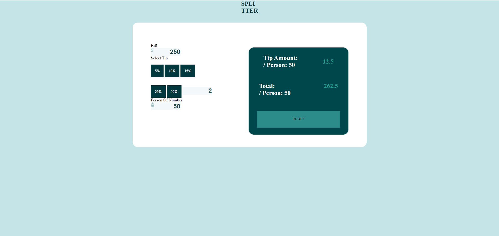

<h1 style="text-align:center;"> Calculate bills & tips </h1>

 <a href="https://mike14112.github.io/calculateTipsAndBill/
 " style="color:skyblue; font-size:26px; text-align:center; ">Link this Project   </a> 

 <h2>About this Project 😊 </h2>
 <h3>This project helps calculate the percentage of the total amount for tips. It's a wonderful project that I took from the Front-end Mentors website for practice. It really helped me at the beginning of my journey.</h3>

<h2> Languages and Tools: </h2>
<h3>   </h3>
 <h2>Installation Guide</h2> 
 <h3> git clone  https://github.com/mike14112/calculateTipsAndBill.git </h3>
 